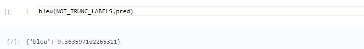
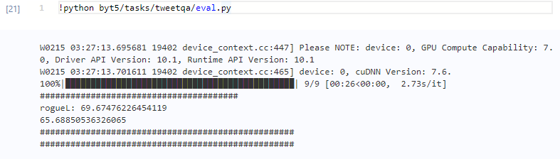

# Paddle-ByT5
Paddle-ByT5
## 1 简介 

**本项目基于PaddlePaddle复现的Byt5，完成情况如下:**

- 在tweetqa和xsum数据集上均达到论文精度
- 我们复现的ByT5是基于paddlenlp
- 我们提供aistudio notebook, 帮助您快速验证模型

**项目参考：**
- [https://github.com/huggingface/transformers/tree/master/src/transformers/models/byt5](https://github.com/huggingface/transformers/tree/master/src/transformers/models/byt5)
- [https://github.com/google-research/byt5](https://github.com/google-research/byt5)
- [https://github.com/JunnYu/paddle_t5](https://github.com/JunnYu/paddle_t5)

## 2 复现精度
>#### 在TweetQA数据集的测试效果如下表。

|模型 |opt|数据集|BLEU-1|BLEU-1(原论文)|rougeL|rougeL(原论文)
| :---: | :---: | :---: | :---: | :---: | :---: | :---: |
|ByT5-small|AdamW|TweetQA|65.68|65.7|69.67|69.7|

>复现代码训练日志：
[复现代码训练日志](https://github.com/yoreG123/Paddle-ByT5/blob/main/logs/tweetqa.log)

>
>#### 在Xsum数据集的测试效果如下表。

|模型 |opt|数据集|BLEU|BLEU(原论文)
| :---: | :---: | :---: | :---: | :---: 
|ByT5-small|AdamW|Xsum|9.36|9.1

>复现代码训练日志：
[复现代码训练日志](https://github.com/yoreG123/Paddle-ByT5/blob/main/logs/xsum.log)

同时logs目录之下提供visualDL日志

## 3 数据集
我们主要复现tweetqa和xsum数据集的精度, 数据集，

tweetqa数据集可以前往此处下载:
[地址](https://tweetqa.github.io/)

xsum数据集可在此处下载: 
[地址](https://aistudio.baidu.com/aistudio/datasetdetail/122619)


## 4环境依赖
运行以下命令即可配置环境(由于nltk在源码中复制，所以可以不安装)
```bash
pip install paddlepaddle-gpu
pip install colorlog
pip install colorama
pip install seqeval
pip install rouge_score
pip install visualdl
pip install sacrebleu
```

## 5 快速开始
由于代码在paddlenlp原始代码中增加一些代码，比如tweetqa以及xsum数据集的加载，以及byt5Tokenizer的部分代码，所以首先执行pip uninstall paddlenlp卸载原始paddlenlp，之后cd到byt5目录之下，便可以引入加入本论文代码的paddlenlp。
1. 权重转换对齐：执行compare.py，注意修改模型路径。结果发现平均误差3.3157e-07符合精度要求。compare.py脚本参考https://github.com/JunnYu/paddle_t5/blob/main/compare.py
>转换之后的模型链接为https://aistudio.baidu.com/aistudio/datasetdetail/123125
2. 调整xsum数据集目录：xsum数据集较大，下载数据集到指定目录，之后注意修改/byt5/paddlenlp/datasets/xsum.py文件的数据集地址，tweetqa数据集我直接放在了项目里，所以不需自己修改文件地址，另外/byt5/tasks/xsum/eval.py中的 --evaluate_file选项改为相应数据集的dev.json文件。（或者执行的时候加参数）
最终结果截图如下(上图为xsum，下图为tweetqa)：
>
>
3. 微调和验证：
以下是训练tweetqa的run.py，验证模型精度的eval.py以及训练xsum的run.py
将MODEL_NAME_OR_PATH替换自己的模型路径
python byt5/tasks/tweetqa/eval.py --model_name_or_path MODEL_NAME_OR_PATH
python byt5/tasks/tweetqa/run.py --model_name_or_path MODEL_NAME_OR_PATH
python byt5/tasks/xsum/run.py --model_name_or_path MODEL_NAME_OR_PATH
以下是验证xsum的脚本，首先直接运行xsum的eval.py,输出all_preds.pd,之后执行evalxsum.py得到bleu结果
python byt5/tasks/xsum/eval.py --model_name_or_path MODEL_NAME_OR_PATH
python byt5/tasks/xsum/evalxsum.py --allpred_path /home/aistudio/all_preds.pd（替换为自己的all_preds.pd地址）
微调之后的预训练模型链接：
>tweetqa18450：https://aistudio.baidu.com/aistudio/datasetdetail/128224
>xsum380000（由于训练资源有限，batchsize设为1，所以训练步数较大）：https://aistudio.baidu.com/aistudio/datasetdetail/127876
4. aistudio链接：
byt5xsum:https://aistudio.baidu.com/aistudio/projectdetail/3245322?contributionType=1&shared=1
byt5tweetqa:https://aistudio.baidu.com/aistudio/projectdetail/3431324?contributionType=1&shared=1

## 6 主要代码路径
1. tokenizer代码（modeling代码同t5）
byt5tokenizer：byt5/paddlenlp/transformers/byt5
2. 数据集加载：
tweetqa18450：byt5/paddlenlp/datasets/tweetqa_paddle.py
xsum：byt5/paddlenlp/datasets/xsum.py
注意，如需加载数据集，应该将两个py文件中的数据集路径加以修改
3. tasks目录中包含两个微调任务的训练与测试脚本，run.py执行微调，args.py设置微调参数，eval.py验证结果
